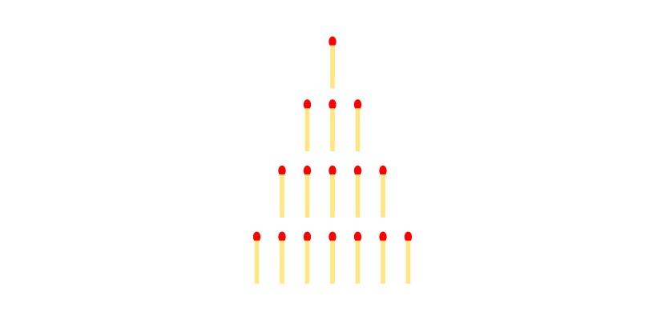

# Nim gameplay in C++
a C++ API for playing the Nim game against a computer

[Nim](https://en.wikipedia.org/wiki/Nim) is a mathematical game of strategy in which two players take turns removing (or "nimming") objects from distinct heaps or piles. On each turn, a player must remove at least one object, and may remove any number of objects provided they all come from the same heap or pile. Depending on the version being played, the goal of the game is either to avoid taking the last object or to take the last object.

The implementation supports both Misere and Noraml game modes. Also included is a "driver" code that shows how to interact with API functionality in the console environment.

All the code is released to Public Domain. Patches and comments are welcome.
It makes me happy to hear if someone finds the algorithms and the implementations useful.

Ehsan Marufi 
April 2013
